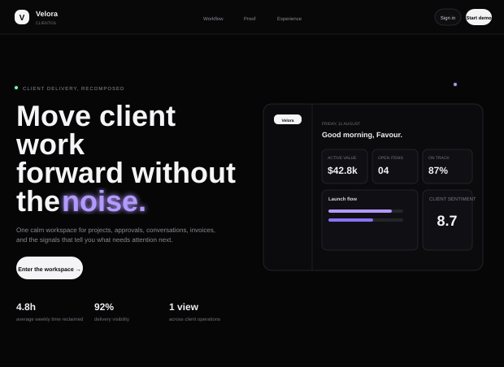
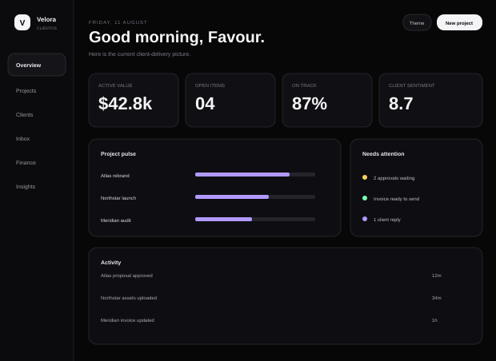
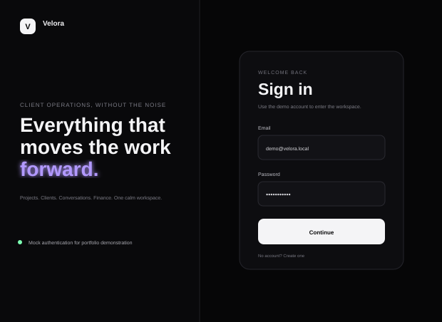
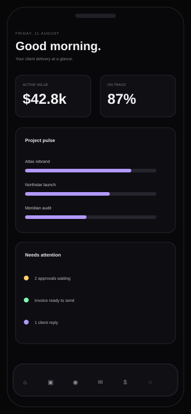

# Velora ClientOS — Frontend Concept

A premium, responsive client-delivery workspace concept for boutique agencies and consultancies.

> **Live demo:** deployment URL will be added after Vercel publication.

## Concept

Velora brings projects, clients, conversations, finance, and operating signals into one calm interface. The experience is intentionally front-end only: authentication, messages, project data, and finance data are mocked for portfolio demonstration.

## Experience highlights

- animated marketing landing page with text-led motion
- dedicated mock sign-in and sign-up flows
- six interactive dashboard views: Overview, Projects, Clients, Inbox, Finance, Insights
- dark/light workspace theme switching
- responsive desktop, tablet, and mobile behavior
- project-detail dialog, mock messaging, focus states, and toasts
- `prefers-reduced-motion` support
- no CSS gradients; depth comes from solid surfaces, borders, shadows, glows, typography, and motion

## Screenshots

### Landing experience



### Dashboard overview



### Sign-in experience



### Mobile experience



## Demo account

- Email: `demo@velora.local`
- Password: `Velora2026!`

The concept also accepts other valid-looking mock credentials.

## Run locally

```bash
npm run serve
```

Open `http://127.0.0.1:4173`.

## Smoke checks

```bash
npm test
```

## Project structure

```text
.
├── index.html
├── styles.css
├── app.js
├── docs/
│   ├── landing.svg
│   ├── dashboard.svg
│   ├── signin.svg
│   └── mobile.svg
├── tests/
│   └── smoke.mjs
├── tools/
│   └── server.mjs
├── package.json
├── vercel.json
└── README.md
```

## Scope note

Velora is a portfolio concept and does not represent a real client platform or production SaaS. All data and interactions are simulated in the browser.
